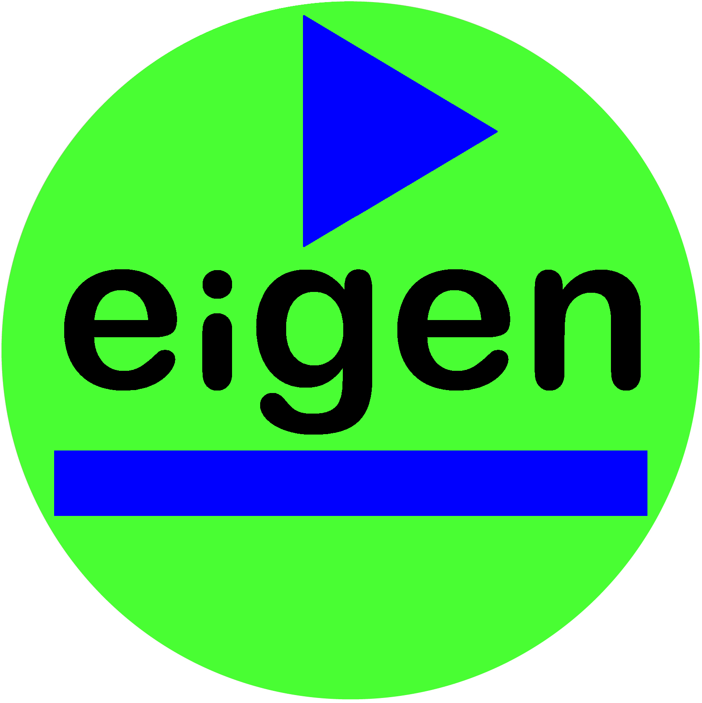

#  EigenFrame
## Platform for dynamic systems on Android

EigenFrame starts with a url request, but instead of getting a simple web page, 
EigenFrame parses specifications (represented in JSON format) to dynamically build an openly programmable application that 
includes Android user-interface components, and provides access to available camera hardware and device sensors.  

More than just a web-browser, EigenFrame has an embedded javascript interpreter with access to internal Android classes,
methods and properties, and a secure-shell client capability to interface with a local Termux app (with openssh)
to integrate *your own* application scripts, in whatever language/tool you choose (bash, git, ruby, perl, python, prolog, gpg ...).
In contrast, web-browsers only have limited scripting access to the host mobile device, from inside a browser window.  

EigenFrame provides asynchronous url/ssh requests, so you can use cloud-based services, or local Termux services 
(like: Apache2/CGI, or Ruby Webrick) to generate dynamic EigenFrame components - the github repository includes examples. 
 
EigenFrame - a truly extensible architecture for dynamic system integration.

## EigenFrame url-request

EigenFrame starts with a url-request to retrieve the application-level security specifications, 
permissions and tab-fragments.  

There are 3 ways to perform the initial EigenFrame url-request:
* launch the EigenFrame app with a default home-url
* use an EigenFrame short-cut (which contains an EigenFrame url)
* an EigenFrame app can be designed launch the url of another completely different EigenFrame app.

The home-url is defined in this eigenframe shared directory file:
> /storage/emulated/0/Android/data/com.sawaya.eigenframe.full/files/home-url.txt

This home-url file contains the following default app-url:
> file:///storage/emulated/0/Android/data/com.sawaya.eigenframe.full/files/app.json

As a simple example, this url returns the following EigenFrame specification:
```json
{
  "type": "EigenFrame",
  "is_secure_window": "true",
  "request_permissions": [
    "android.permission.CAMERA",
    "android.permission.WRITE_EXTERNAL_STORAGE",
    "android.permission.INTERNET"
  ],
  "tab_list": [
    {
      "icon_name": "ic_launcher_round.",
      "type": "EigenFragment",
      "url": "file:///storage/emulated/0/Android/data/com.sawaya.eigenframe.full/files/playlist.json"
    },
    {
      "name": "PlayList\nfrom github",
      "type": "EigenFragment",
      "url": "https://raw.githubusercontent.com/jsawaya/eigenframe/master/web/frames/playlist.json"
    }
  ]
}
```


Android activities are typically composed of several fragments that can be dynamically loaded and unloaded to manage system resources.

Tabs are an easy way to select which fragments are currently active, although your app designs may 
choose to hide this particular feature by using PopupScreen components.

The tab_list can define any number of fragments that load as you select them.  

Tabs can either be selected with the user interface, or programmatically selected.

Tabs can have a "name" attribute and/or an "icon_name" attribute to define the tab label.  

Tabs of "type": "EigenFragment" have the "url" attribute to load components dynamically. 

## EigenFrame components

A fragment can layout scrollable components below the tab selection area, 
or create any number of new screen components.

Here are the types of component specifications:

Component type | Description | Examples
-------------- | ----------- | --------  
[EigenFrame](./web/docs/EigenFrame.md)  | represents a top-level application specification | [examples](./web/apps/app1.json)
[EigenFragment](./web/docs/EigenFragment.md)  | represents each tab/fragment in an application | [examples](./web/apps/app1.json)
[PopupScreen](./web/docs/PopupScreen.md) | represents a collection of components in a fullscreen window | [example](./web/frames/test-PopupScreen.json) 
[LinearLayout](./web/docs/LinearLayout.md)  | sequence of components arranged vertically or horizontally | [example](./web/frames/playlist.json) 
[RelativeLayout] | not implemented yet |
[ConstraintLayout] | not implemented yet |
[TextView](./web/docs/TextView.md)  | component shows plain text | [example](./web/frames/test-TextView.json) 
[HtmlView](./web/docs/HtmlView.md)  | component shows simple html, internal-icons, and simple web-links | [example](./web/frames/test-HtmlView.json) 
[ImageView](./web/docs/ImageView.md)  | component shows images and external-icons | [example](./web/frames/test-ImageView.json) 
[WebView](./web/docs/WebView.md)  | component shows elaborate html, and url web-page  - javascript capable  | [example](./web/frames/test-WebView.json) 
[HorizontalLine](./web/docs/HorizontalLine.md) | component that shows a horizontal line <hr/> to separate components in vertical LinearLayout | [example](./web/frames/playlist.json) 
[VerticalLine](./web/docs/VerticalLine.md) | component that shows a vertical line to separate components in horizontal LinearLayout |  
[EditText](./web/docs/EditText.md) | component that represents a string value, shows an editable text area | [example](./web/frames/test-EditText.json) 
[Button](./web/docs/Button.md)  | component that shows plain text and has an "on_click" callback attribute  | [example](./web/frames/test-Button.json) 
[ToggleButton](./web/docs/ToggleButton.md) | component that represents a integer value [0, 1], shows as bi-modal button label |  [example](./web/frames/test-ToggleButton.json) 
[CheckBox](./web/docs/CheckBox.md) | component that represents a small box with or without a check mark, with integer value [0, 1] |  [example](./web/frames/test-CheckBox.json) 
[Switch](./web/docs/Switch.md) | component that represents a  small switch [off, on] with integer value [0, 1] |  [example](./web/frames/test-Switch.json) 
[RadioButton](./web/docs/RadioButton.md) | component that represents a multiple-choice option-list, and a selected index | [example](./web/frames/test-RadioButton.json) 
[Spinner](./web/docs/Spinner.md) | component that represents a popup multiple-choice option-list, and a selection index |   [example](./web/frames/test-Spinner.json) 
[ListView](./web/docs/ListView.md) | component that represents a multiple-choice option-list, with a row layout and a selected index | [example](./web/frames/test-ListView.json) 
[SelectDialog](./web/docs/SelectDialog.md) | component that represents a popup multiple-choice option-list selection index| [example](./web/frames/test-SelectDialog.json) 
[AlertDialog](./web/docs/AlertDialog.md) | component represents a popup multiple-choice option-list | [example](./web/frames/test-AlertDialog.json) 
[PopupTextView](./web/docs/PopupTextView.md) | component that shows a small transient popup text window | [example](./web/frames/test-PopupTextView.json) 
[PopupHtmlView](./web/docs/PopupHtmlView.md) | component that shows a small transient popup html window | [example](./web/frames/test-PopupHtmlView.json) 
[JavaScript](./web/docs/JavaScript.md) | component calls embedded javascript  | [example](./web/frames/test-Javascript.json) 
[SecureShell](./web/docs/SecureShell.md) | component represents ssh commands | [example](./cgi-bin/ruby-lib/eigen-lib.rb) 
[UrlRequest](./web/docs/UrlRequest.md) | component represents url request - not fully tested |
[Variable] | not implemented yet |




