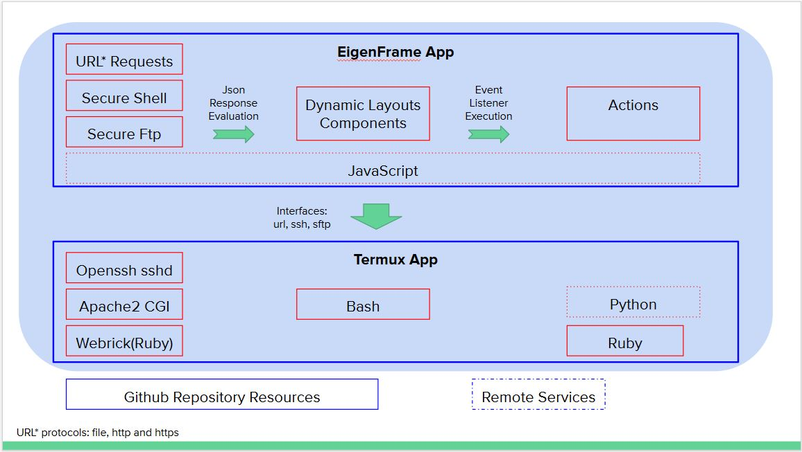

#  EigenFrame
## Github Framework for Dynamic App Specification Deployment, Rendering & Execution

EigenFrame starts with a url request, but instead of getting a simple web page, EigenFrame parses specifications (represented in JSON format) to dynamically build an openly programmable application that includes Android user-interface components, and provides access to certain device sensors and hardware.

More than just a web-browser, EigenFrame has an embedded javascript interpreter with access to Android classes, methods and properties, and a secure-shell client capability to interface with a local Termux app (through openssh) to integrate your own application scripts, in *whatever* language/tool you choose (bash, git, ruby, perl, python, prolog, gpg ...). In contrast, web-browsers only have limited scripting access to the host mobile device, from inside a browser window.

EigenFrame also provides asynchronous url, ssh, and sftp requests, so you can use cloud-based services, or local Termux services (like: Apache2/CGI, or Ruby Webrick) to generate dynamic EigenFrame components at runtime.

EigenFrame - a truly extensible architecture for dynamic system integration.

https://play.google.com/store/apps/details?id=com.sawaya.eigenframe

[EigenFrame App ScreenShots](./web/docs/EigenFrameApp.md)

### App-level specifications:

App spec | Description 
-------------- | ----------- 
[EigenFrame](./web/docs/EigenFrame.md)  | represents the top-level application specification 
[EigenFragment](./web/docs/EigenFragment.md)  | a tab/fragment can layout components within the tab selection area. 

### EigenFrame Layouts:

Layout type | Description 
----------- | ----------- 
[PopupScreen](./web/docs/PopupScreen.md) | layout a sequence of components in a new fullscreen window, and hides tabs (also an Action type) 
[LinearLayout](./web/docs/LinearLayout.md)  | sequence of components arranged vertically or horizontally, possibly scrollable 
RelativeLayout | not implemented yet 
ConstraintLayout | not implemented yet 

### EigenFrame Components

Component type | Description 
-------------- | ----------- 
[Button](./web/docs/Button.md)  | stateless button component with optional icon and has an "on_click" callback attribute  
[TextView](./web/docs/TextView.md)  | shows plain text, with built-in fonts 
[HtmlView](./web/docs/HtmlView.md)  | shows simple html, internal-icons, and simple web-links 
[WebView](./web/docs/WebView.md)  | shows elaborate html, and url web-page  - javascript capable 
[ImageView](./web/docs/ImageView.md)  | shows image or external-icons 
[EditText](./web/docs/EditText.md) | a string value, with an editable text area for state value 
[CheckBox](./web/docs/CheckBox.md) | a small box with or without a check mark, with integer value [0, 1] 
[Spinner](./web/docs/Spinner.md) | a popup multiple-choice option-list, and a selection index 
[Switch](./web/docs/Switch.md) | a small switch [off, on] with an integer state value [0, 1] 
[ToggleButton](./web/docs/ToggleButton.md) | bi-modal button label with an integer state value [0, 1] 
[RadioButton](./web/docs/RadioButton.md) | a multiple-choice option-list, and a selected index 
[HorizontalLine](./web/docs/HorizontalLine.md) | a horizontal line 
 to separate components in vertical LinearLayout 
[VerticalLine](./web/docs/VerticalLine.md) | a vertical line to separate components in horizontal LinearLayout 
[LinearLayout](./web/docs/LinearLayout.md)  | layouts may be nested components, within another layout 
[ListView](./web/docs/ListView.md) | a complex/dynamic multiple-choice option-list, with runtime row layout and define items from cached file 

### EigenFrame Actions:

Action type | Description
----------- | ----------- 
[ToastMessage](./web/docs/ToastMessage.md) | send a transient non-blocking "toast" message to the user's screen - good for a quick status update 
[AlertDialog](./web/docs/AlertDialog.md) | popup dialog with "positive", "negative", and "neutral" options - e.g. Are you sure: "YES", "NO", "CANCEL" 
[SelectDialog](./web/docs/SelectDialog.md) | popup multiple-choice option-list selected index
[PopupTextView](./web/docs/PopupTextView.md) | popup transient plaintext window
[PopupHtmlView](./web/docs/PopupHtmlView.md) | popup transient HTML window 
[PopupScreen](./web/docs/PopupScreen.md) | popup collection of components in a new fullscreen window (also a Layout type)
[JavaScript](./web/docs/JavaScript.md) | embedded javascript  
[UrlRequest](./web/docs/UrlRequest.md) | url request
[SecureShell](./web/docs/SecureShell.md) | ssh connection 
[SecureFtp](./web/docs/SecureFtp.md) | sftp commands 
[Variable](./web/docs/Variable.md) | dynamic variable values: boolean, integer, long, string  
Cache | dynamic cache files, String | BinaryArray (not implemented yet)
[ActionList](./web/docs/ActionList.md) | calls a sequence of actions 
[Define](./web/docs/Define.md) | define a reusable cached component 
[Clone](./web/docs/Clone.md) | clone creates a new instance of a defined reusable cached component 

### Attribute Descriptions :

Attribute | Description
--------- | ----------- 
[Font](./web/docs/font.md) | Available fonts (see individual licences)
[EditText Filter](./web/docs/EditText-filter.md) | Controls valid keyboard entries
[Icon](./web/docs/icon.md) | Icon and Branding Support

